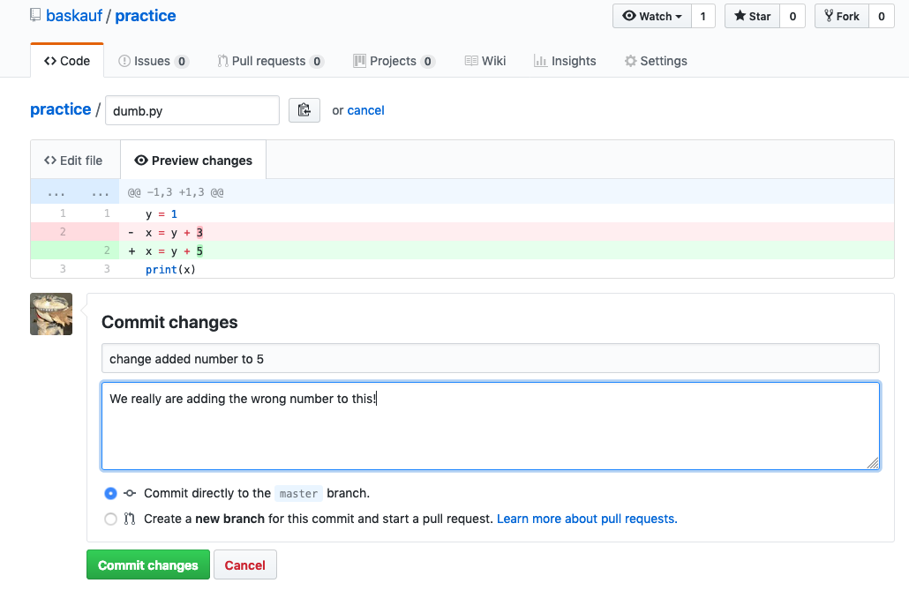
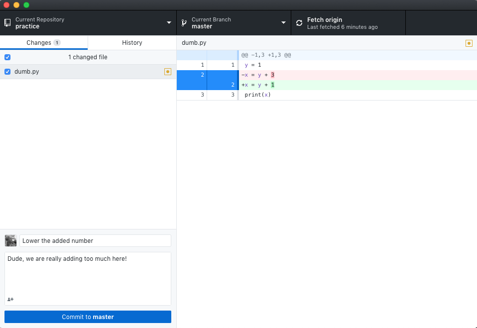
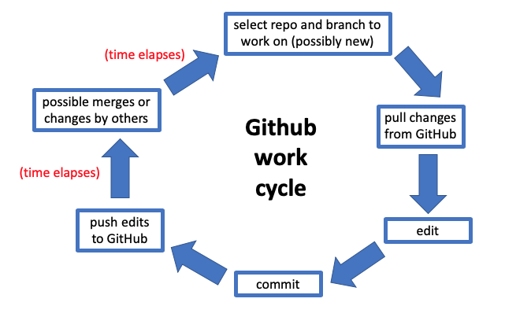
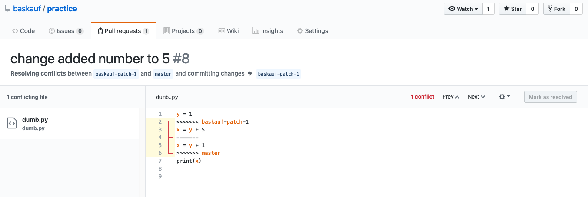

# Workshop II: GitHub for Intermediate Users - Part B

# Version conflicts

Git is really good at tracking changes made to documents as they move through time.  Optimally, each version should fall into place somewhere in the linear history of the document.  However, there are situations where versions conflict and it isn't clear what version of a document is the most recent version.

Here's an example of a conflict arising from a simple version control system where versions are tracked by appending the date to the filename.  

This system works well if each collaborator is careful to always use the most recent version.  But if anyone fails to use the most recent version, it becomes unclear what should be the final version.

## Resolving a conflict that occurs when pushing

Sometimes when you attempt to push a commit, you have an unpleasant surprise: a warning saying that the repository has been updated since your last pull.

There are two common ways that this can happen. Sometimes I've been working on a document on one computer, then start working on it on a different computer having forgotten to pull the most recent commits from GitHub. Another possibility is that you've been working on a document for a long time, and during that time, a collaborator made changes to the same document and pushed them to GitHub before you made your changes.  

In the following example, my alter ego and collaborator, Tomy the Cat, has edited the Python script we were working on while I was editing it.  

---

---

However, I was working offline in a text editor and changed the added number to 1 instead of 5.  

---

---

Here's what happened when I tried to push my changes:

The problem is pretty easy to fix if I've been using Atom as my text editor.  Here are the steps to fix the problem:

Go to the Repository menu and select Pull.

I will then get a popup message like this:

If I click on the "Open in Atom" button, I'll get this screen in the Atom editor:

The editor presents me with a choice between my change and Tomy's change.  Of course I'm right, so I pick my change.  Now the popup has changed:

and I can now commit the resolved file.

## Work cycle for working with the Desktop client

## A better way to manage changes

When Tomy wanted to change the code, instead of committing his change directly to the master branch, he could have created a new branch.

---

---

After the "patch" branch is created, a new page opens to create a pull request:

---

---

Notice that the pull request includes an "@mention" with my username.  That generates an email to the collaborator:

---

---

Clicking on the link to view the diff shows how the two branches differ:

---

---

The collaborator can follow the link in the email to the pull request dialog and approve the change if they want.

---

---

After clicking Merge pull request, there's a confirmation and opportunity to comment.

---

---

A happy ending! The change was made without conflicts!

---

---

Let's imagine a less happy ending. Perhaps I didn't see Tomy's email about the pull request and had gone ahead and made my change directly to the master branch before merging his patch branch.  That's generated a conflict that now shows up in the pull request dialog.

---

---

Clicking on the Resolve conflicts button brings up the online editor showing where the conflicts lie:

---

---

After editing the document so that the conflict is gone, click the Mark as resolved button, then click Commit merge.

---

---

This merges the modified, unconflicted branch into the patch branch.  You'll then go back to the pull request screen and have an opportunity to merge the patch branch into the master branch. The pull request can then be merged and the patch branch deleted.

The creation of pull requests and resolving conflicts between branches can also be done offline, but the nice, linear record of the pull request history is best seen online.
